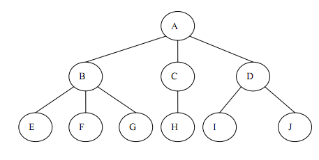
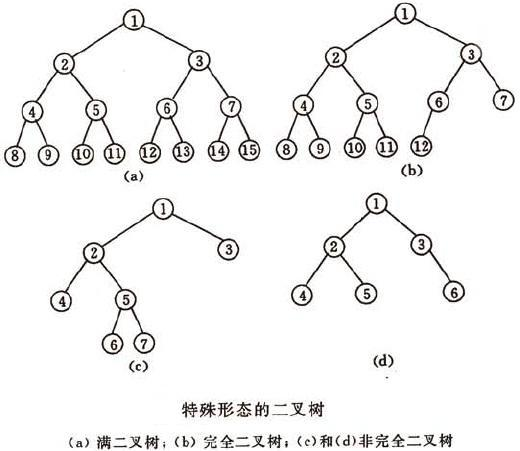
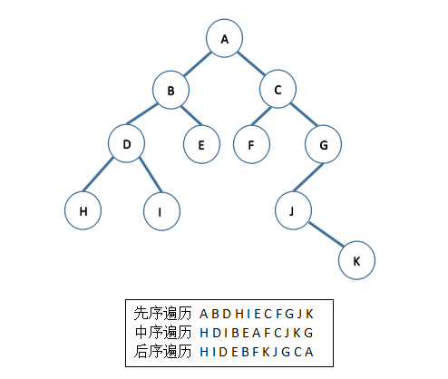
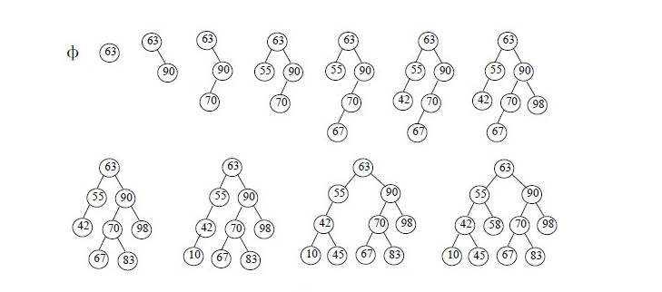
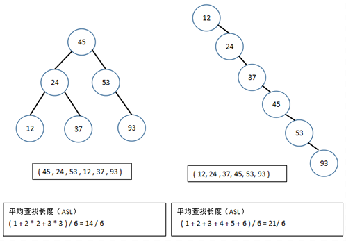

#### 数据结构学习
2017年6月27日 

#### 数据结构特性
数据结构 |                    优点                    |                缺点
--------|--------------------------------------------|----------------------
数组    | 插入速度快，如果知道下标，可以快速提取/修改   | 查找慢、删除慢、大小固定
有序数组| 比无序数组查找快                             | 删除。插入慢、大小固定
栈      | LIFO(后进先出)方式的存取                     | 存取其他项很慢
队列    | FIFO(先进先出)方式的存取                     | 存取其他项很慢
链表    | 插入快、删除快(删除时不需要整体移动元素)      | 查找慢
二叉树  | 查找、插入、删除都快（如果树保持平衡）        | 删除算法复杂
红黑树  | 查找、插入、删除都快。树总是平衡的            | 算法复杂
234树   | 查找、插入、删除都快。树总是平衡的。对磁盘有用| 算法复杂
哈希表  | 如果关键字已知，则存取极快，插入块            | 删除慢，如果不知道关键字，存取慢，对空间利用不充分
堆      | 插入、删除快，对最大数据项存取块              |对其他数据项存取满
图      | 对现实世界建模                               | 有些算法慢且复杂

#### 冒泡排序:概念上简单，但非常慢On^2
* 假设一排人，从左到右为 0  -  n-1;
* 第一轮，比较0和1，将小的移到左边；比较1和2，将小的移到左边；依次到最后；
* 第二轮，比较1和2，然后2和3；依次到最后；
#### 选择排序：改进了冒泡排序On^2
* 假设一排人，从左到右为 0  -  n-1;
* 第一轮，找出 0 - n-1中最小的，移到最左边0；
* 第二轮，找出 1 - n-1中最小的，移到左边1；
* 依次到最后
#### 插入排序：基本排序中最好的一种,比冒泡快一倍，常被用在复杂排序的最后阶段On^2
* 排序已经排好了一半的情况：队伍中有一个作为标记的队员，该队伍左边的所有队员已经有序；
* 将被标记的队员从原来位置取出，和其左边的有序队员进行比较，插入对应的位置；
* 然后将被标记队员原位置右边的队员变成被标记队员；再次进行该操作

#### 递归：方法自己调用自己-比起循环，概念上简化了，并非有效率

#### 线性表
* 数组：连续的存储单元依次存储数据元素
~~~
    大小固定，如果需要动态数组，可以在数组满后，使用新的大数组来替换当前数组以实现。
    可以使用下标来访问和修改元素。
    查询和修改效率高；插入和删除效率低（例如在第一个位置插入元素，需要把所有元素后移）；
~~~

* 链表：一组任意的存储单元存储数据元素
~~~
    物理存储单元中非连续、非顺序的存储结构；元素的逻辑顺序通过链表的指针次序实现；
    每个节点/元素由数据部分Data和链部分Next组成，Next指向下一个节点，当添加或删除时，只需要改变相关节点的Next指向，效率高；
    查询和修改效率低，插入和删除效率高;
    以上为单链表，此外还有
        循环单链表：最后一个节点指向第一个节点；
        双向链表：节点中包含两个指针部分，一个指向前元素，一个指向后元素，LinkedList就是双向链表；
            双向链表可以倒序遍历，如果单向链表，遍历时需要倒退需要从头开始遍历
        循环双向列表：最后一个节点指向第一个节点
~~~

#### 栈和队列-特殊的线性表
* 栈:LIFO（Last In First Out）后进先出的线性表
~~~
    栈是限制插入和删除只能在一个位置进行的表，该位置是表的末端，叫栈顶；
    栈只允许访问最后插入的数据元素；
    栈的基本操作有
        push(进栈):插入在栈顶
        pop(出栈)：删除最后一个元素(栈顶的)
    LinkedList实现了栈的所有操作
~~~
* 队列:FIFO（First In Fitst Out)先进先出的线性表
~~~
    元素只能从队列尾部插入，从队列头部访问和删除;
    还有优先级队列，优先级最高的先被删除，PriorityQueue实现了优先队列;
    还有双向队列，头尾都可存取的，DQUEUE；
~~~

#### 树与二叉树
* 树:由n(n>=1)个有限节点组成的具有层次关系的集合
~~~
    每个节点有0个或多个子节点；没有父节点的子节点称为根节点；每个非根节点有且只有一个父节点；每个子节点可以分为多个不相交的子树；
~~~

* 二叉树:每个节点最多有2个子节点的树（可以为空）；
~~~
    子树被称为“左子树”和“右子树”；通常用于实现二叉查找树和二叉堆;
    二叉树的第i层最多有2^(i-1)个节点，深度为K的二叉树最多有2^K-1个节点;
    特殊形态（下图）:
        满二叉树:一个深度为K，有2^K-1个节点的二叉树;
        完全二叉树：若设二叉树的深度为k，除第 k 层外，其它各层 (1～k-1) 的结点数都达到最大个数，第 k 层所有的结点都连续集中在最左边，这就是完全二叉树。
~~~

~~~
    二叉树遍历：
        二叉树主要由3个基本单元组成：根节点、左子树和右子树;
        如果限定先左后右，那么根据三个部分的顺序不同，可以分为先序遍历、中序遍历和后序遍历三种；
    先序遍历：先访问根节点(A)，再先序遍历左子树(BDHIE)，最后先序遍历右子树(CFGJK)；访问根结点的操作发生在遍历其左右子树之前。
    中序遍历：先中序遍历左子树(HDIBE)，再访问根节点(A)，最后中序遍历右子树(FCJKG)；访问根结点的操作发生在遍历其左右子树之中
    后序遍历：先后序遍历左子树(HIDEB)，再后序遍历右子树(FKJGC)，最后访问根节点(A)；访问根结点的操作发生在遍历其左右子树之后
~~~

* 二叉查找树/二叉排序树:
    1. 若左子树不为空，则左子树所有节点的值小于根节点的值；
    2. 若右子树不为空，则右子树所有节点的值大于根节点的值；
    3. 左右子树也分别为二叉查找树；
    4. 没有键值相同的节点.
    

* 性能分析：对于二叉查找树来说，当给定值相同但顺序不同时，所构建的二叉查找树形态是不同的
    * 含有n个节点的二叉查找树的平均查找长度和树的形态有关。最坏情况下，当先后插入的关键字有序时，构成的二叉查找树蜕变为单支树，
    树的深度为n，其平均查找长度(n+1)/2(和顺序查找相同），最好的情况是二叉查找树的形态和折半查找的判定树相同，其平均查找长度和log2(n)成正比。
    平均情况下，二叉查找树的平均查找长度和logn是等数量级的，所以为了获得更好的性能，通常在二叉查找树的构建过程需要进行“平衡化处理”，
    之后我们将介绍平衡二叉树和红黑树，这些均可以使查找树的高度为O(log(n))。

* 平衡二叉树/AVL树：
    1. 左右子树都是平衡二叉树，且左右子树的深度差的绝对值不超过1
* 红黑二叉树：是平衡二叉树的一种，放弃完全平衡，最求大致平衡

#### 图
*　图：图是一种较线性表和树更为复杂的数据结构；
在线性表中，数据元素之间仅有线性关系；
在树形结构中，数据元素之间有着明显的层次关系；
而在图形结构中，节点之间的关系可以是任意的，图中任意两个数据元素之间都可能相关。
    

